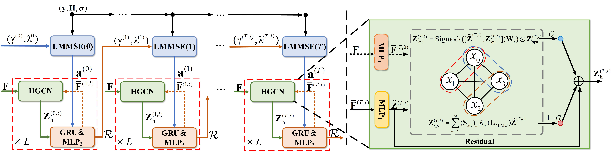

# HGCEPNet
"Code for Hybrid_Graph Convolutional Network Enhanced Expectation Propagation for MIMO Detection"

# Acknowledgment
The base code originates from [GCEPNet](https://github.com/wzzlcss/GCEPNet)
# Citation
Please consider citing our works in your publications, if our findings help your research.

```bibtex
@article{li2026hybrid,
  title={Hybrid Graph Convolutional Network Enhanced Expectation Propagation for MIMO Detection},
  author={Li, Rui and Song, Jian and Lei, Shiwen and Wang, Qingwang and Shen, Tao},
  journal={IEEE Transactions on Vehicular Technology},
  year={2026},
  publisher={IEEE}
}
```
# Contact
For any question about our paper or code, please email lrkofzzz@163.com
